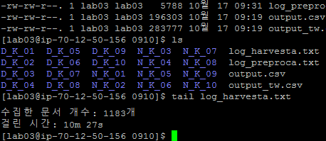
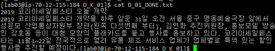
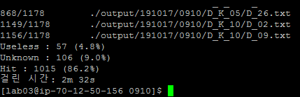
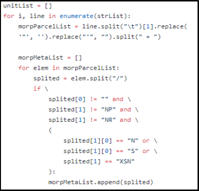
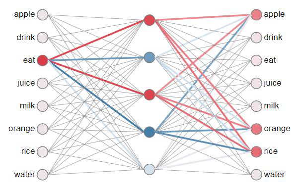
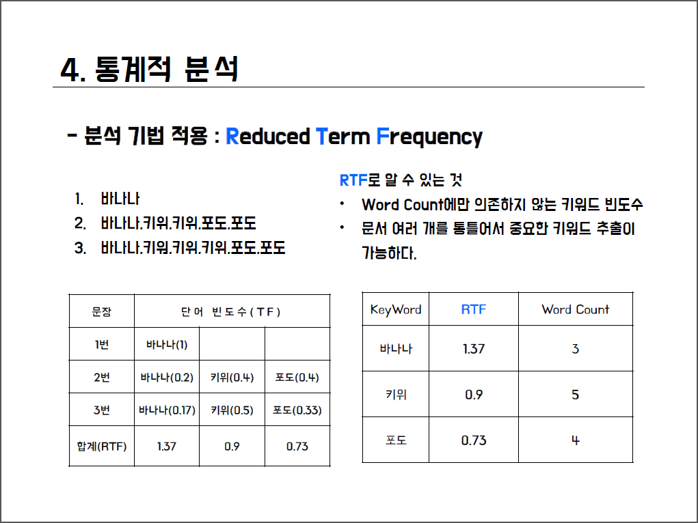
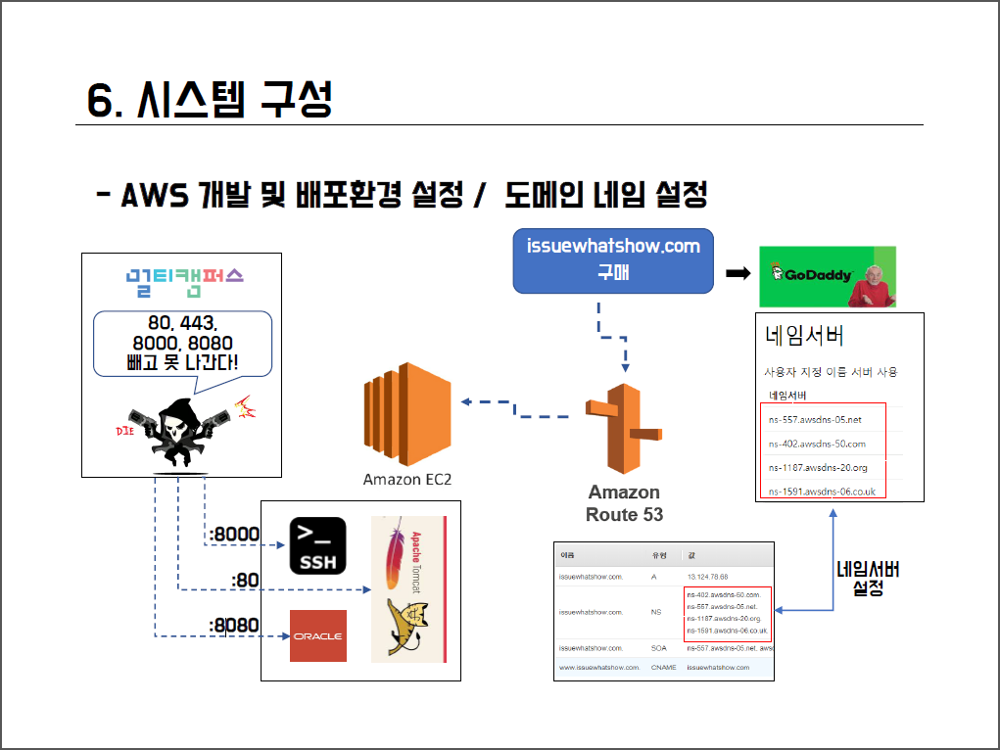
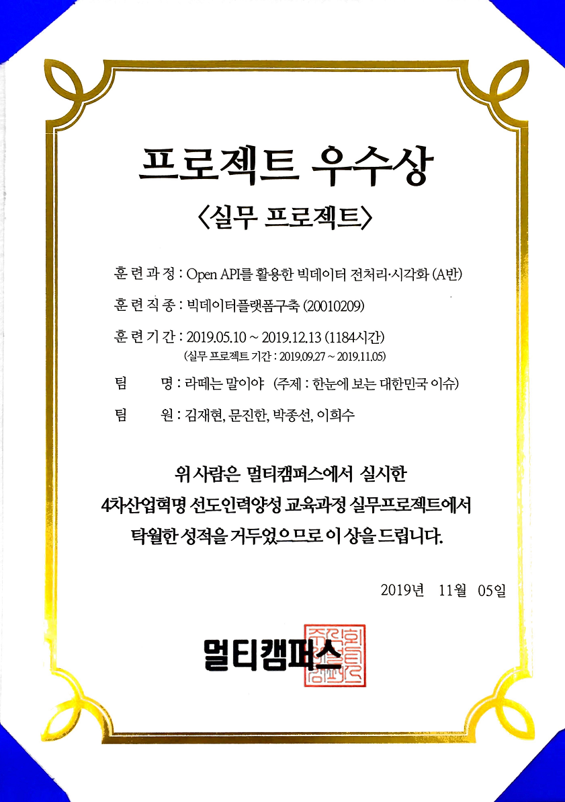

# MULTICAMPUS-2nd-project

**잇슈왓슈(IssutWhatShow) - 한 눈에 보는 대한민국 핫이슈** (`spring`, `python`, `morphology`, `word2vec`, `tf-idf`, `three.js`, `aws`)

:link: [배포 URL: http://issuewhatshow.com](http://issuewhatshow.com)

:link:[발표 자료](doc/최종%20제출%20자료/%5B라떼는말이야%5D잇슈왓슈_PPT.pdf)

## 개요

**현재** 대한민국에서 일어나고 있는 잇슈들을 짧은 시간에 파악할 수 있도록, 이슈 키워드들을 **중요도**와  **맥락** 그리고 **연관성**을 포함하여 **3D**로 시각화하여 보여주는 웹 어플리케이션.

**웹** 서비스는 `Spring MVC`로 구축하였으며 **수집/전처리/분석** 모듈은 `python` 코드로 짜여져있다. 

### 웹서비스 실행 화면

### 소스 구성

#### **웹 서비스** - Web

- `Spring MVC`
- `Oracle RDBMS`(교육용 xe)
- `three.js` 기반 `3d-force-graph` 시각화 라이브러리

#### 수집/전처리기 - Crawllica

`crawllica`: 자체 개발 수집/전처리 최상위 `python` 모듈

- `harvesta`: 웹 문서 수집기
  - NAVER 관련 모듈
  - DAUM 관련 모듈
  - Google 관련 모듈
  - Twitter 관련 모듈
- `preproca`: 웹 문서 전처리기
  - whitelist 처리 코드
  - blacklist 처리 코드
  - 정규표현식 기반 불용문자 제거기

#### 분석기 - Analyza2

`analyza`: 자체 개발 NLP 분석기 최상위 `python` 모듈

- `morpheus`: Khaiii 형태소 분석기를 이용한 형태소 분석 driver  모듈
- `word2veca`: gensim package의 word2vec driver 모듈
- `tf-idf`: TF-IDF 계산 모듈

### 기존 이슈 파악 방법과의 차별성

#### 실시간 키워드 확인의 한계

포털 사이트의 실시간 검색어 트렌드는, 개별적인 키워드의 우선순위는 확인 할 수 있으나 따로 분류 되어 있는 동일한 사건에 대한 키워드 간의 연관관계를 파악할 수 없고, 또한 실제로 무슨 내용인지에 대한 맥락이 빠져있어서 단순 트렌드 키워드를 파악 외에는 특별히 알 수 있는 정보가 없다.

#### 실시간 트렌트 파악의 한계

기존의 실시간 트렌드 서비스는 관련 키워드 간의 1-depth 연관관계에 대한 정보를 알 수는 있으나 메인 키워드를 빼고는 키워드의 중요도 정보를 파악할 수 있는 scalar 정보가 제공되지 않는다. 또한 정작 해당 키워드가 순위권에 올라와 있어도 현재 이슈가 되고 있는 뉴스를 보는 섹션에는, 해당 키워드와는 무관한 단순 트렌드 순위 상위권의 뉴스들을 보여주고 있다. 따라서 해당 이슈의 맥락 파악에도 한계가 있고 자세한 내용으로 이어지는 연결 서비스에도 한계가 있다.

## 사용 기술

### Spring Framework

### Web scraping

crawllica - 자체 구현한 python 기반 웹 스크래퍼

### Data preprocessing

preproca - 자체 구현한 python 기반 본문 text 추출기

### Morphology

카카오 Khaiii 형태소 분석기  linux 환경 빌드 및 드라이버 루틴 구현

### Word2Vec

python word2vec 패키지를 이용한 단어간 관계도 계산

### TF-IDF

python 으로 코딩한 단어 중요도 파악 코드 구현

- DBMS(Oracle)

- AWS

  배포시 AWS Free-tier EC2 사용

  

## 주요 기능

### 이슈 키워드 3D 시각화

- 키워드별 중요도에 맞춰 크기 조절
- 키워드간 연관도에 따른 거리 조절
- 유사 뉴스 그룹핑

### 중요도 순 정렬을 통한 표시 키워드 필터링

화면에 정보가 많아 다소 복잡함을 우측 상단의 중요도 threshold 컨트롤를 이용하여 키워드의 표시 갯수를 줄일 수 있다.

### 실시간 연관 뉴스 검색

키워드 클릭 시 연관 키워드를 묶어 해당 뉴스를 매우 높은 정확도로 검색할 수 있다.

### 브리핑 패널을 통한 중요 키워드 바로가기

좌측에 브리핑 패널 컨트롤을 두어 각 중요 키워드별로 한 눈에 볼 수 있게하고, 해당 키워드 그룹으로 바로 이동할 수 있는 기능을 두었다.

### 특정 날짜/시간의 지나간 이슈 보기 및 시간대별 페이지네이션

지나간 시간대의 중요 이슈를 파악할 수 있도록 과거 이력을 볼 수 있는 기능을 넣었다. (추후 시계열 분석을 할 수 있는 여지가 있음)

## 결과 및 수상 내역

멀티캠퍼스 4차산업혁명선도인력양성과정[4차5기] **실무프로젝트 우수상** (Open-API를 활용한 전처리/시각화 B반 1위)

